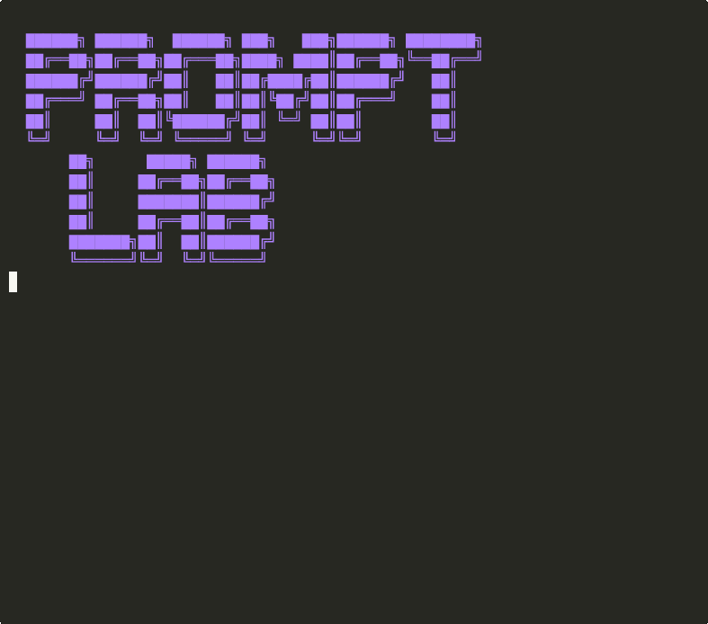

# promptlab

[](https://pypi.org/project/promptlab/)
[](https://pypi.org/project/promptlab/)
[](https://opensource.org/licenses/MIT)
[](https://github.com/naveenkumarbaskaran/promptlab/actions)

**Git for your prompts.** Version, diff, validate, and A/B test LLM prompts with confidence.

```
pip install promptlab
```

## 🎬 Demo

<p align="center">
  
  <br>
  <em>Creating prompts, diffing versions, running A/B tests, and promoting the winner to production</em>
</p>

---

## The Problem

Your prompts are the most important code you write, but you manage them as raw strings:

- ❌ Edited inline, no version history
- ❌ "Did that last prompt change work?" → No way to know
- ❌ Typo in a variable → silent hallucination
- ❌ A/B testing prompts → custom scripts every time
- ❌ Deploying a bad prompt → rollback is copy-paste

## The Solution

```bash
$ promptlab init
Created .prompts/ directory

$ promptlab list
┌──────────────────────┬─────────┬────────────────────────┐
│ Prompt               │ Version │ Last Modified          │
├──────────────────────┼─────────┼────────────────────────┤
│ system_prompt        │ v3      │ 2026-04-28 14:30       │
│ search_tool_prompt   │ v2      │ 2026-04-25 09:15       │
│ summarizer           │ v5      │ 2026-05-01 16:42       │
└──────────────────────┴─────────┴────────────────────────┘

$ promptlab diff system_prompt v2 v3
  You are a helpful assistant.
- Be concise. Maximum 2 sentences.
+ Be thorough. Provide detailed explanations with examples.
+ Always cite sources when making factual claims.
```

## Quick Start

### 1. Initialize

```bash
promptlab init
# Creates .prompts/ directory with schema
```

### 2. Create a prompt

```python
from promptlab import Prompt

# Define a typed prompt template
system = Prompt(
    name="order_analyst",
    template="""You are an order analyst assistant.

The user will ask about maintenance order {{order_id}}.
Plant: {{plant}}
Priority: {{priority}}

Rules:
- Be concise and factual
- Always include the order number in your response
- If unsure, say so
""",
    variables={"order_id": str, "plant": str, "priority": str},
    metadata={"author": "team-alpha", "model": "gpt-4o"},
)

# Render with type validation:
rendered = system.render(order_id="4002310", plant="1010", priority="High")

# Raises TypeError if you pass wrong types or miss a variable:
system.render(order_id=123)  # TypeError: 'order_id' must be str, got int
system.render(order_id="4002310")  # TypeError: missing required variable 'plant'
```

### 3. Version your prompts

```python
from promptlab import PromptStore

store = PromptStore(".prompts")

# Save a new version (auto-increments)
store.save(system)  # → v1

# Edit and save again
system.template += "\n- Always be polite"
store.save(system)  # → v2

# Load a specific version
v1 = store.load("order_analyst", version=1)
latest = store.load("order_analyst")  # latest version
```

### 4. Diff versions

```python
from promptlab import diff_prompts

changes = diff_prompts(store, "order_analyst", v1=1, v2=2)
print(changes)
# + - Always be polite
```

Or from CLI:
```bash
promptlab diff order_analyst v1 v2
```

### 5. A/B test prompts

```python
from promptlab import ABTest

test = ABTest(
    prompt_name="summarizer",
    version_a=3,
    version_b=4,
    dataset="eval/summarize_test.jsonl",
    metric="length",  # or custom function
)

results = test.run()
print(results)
# Version A (v3): avg_length=45.2, avg_latency=1.2s
# Version B (v4): avg_length=32.1, avg_latency=0.9s
# Winner: v4 (shorter, faster)
```

### 6. Deploy

```python
# Promote a version to "production"
store.promote("order_analyst", version=2, env="production")

# In your app:
prompt = store.load("order_analyst", env="production")
```

## CLI Commands

```bash
promptlab init                          # Initialize prompt store
promptlab list                          # List all prompts with versions
promptlab show <name>                   # Show latest prompt content
promptlab show <name> --version 3       # Show specific version
promptlab diff <name> v1 v2             # Diff two versions
promptlab validate                      # Validate all prompts (types, variables)
promptlab promote <name> v3 production  # Promote version to env
promptlab history <name>                # Show version history
promptlab export <name> --format json   # Export prompt as JSON
```

## File Structure

```
.prompts/
├── prompts.yaml          # Registry of all prompts
├── order_analyst/
│   ├── v1.yaml           # Version 1
│   ├── v2.yaml           # Version 2 (current)
│   └── metadata.yaml     # Author, model, env mappings
├── summarizer/
│   ├── v1.yaml
│   ├── v2.yaml
│   ├── v3.yaml
│   └── metadata.yaml
└── eval/
    └── summarize_test.jsonl  # A/B test datasets
```

Each version file:
```yaml
# .prompts/order_analyst/v2.yaml
version: 2
created: "2026-04-28T14:30:00Z"
template: |
  You are an order analyst assistant.
  The user will ask about maintenance order {{order_id}}.
  ...
variables:
  order_id: { type: str, required: true }
  plant: { type: str, required: true }
  priority: { type: str, required: true, default: "Medium" }
metadata:
  author: team-alpha
  model: gpt-4o
  note: "Added politeness rule"
```

## Features

| Feature | Description |
|---------|-------------|
| **Versioning** | Auto-incrementing versions, full history |
| **Type Safety** | Pydantic-validated variables, catches typos |
| **Diffing** | Compare any two versions, unified diff format |
| **A/B Testing** | Run evaluations with custom metrics |
| **Environments** | Promote versions to dev/staging/production |
| **Validation** | CI-ready: `promptlab validate` catches broken prompts |
| **Git-friendly** | YAML files, meaningful diffs in PRs |
| **Templates** | Jinja2-style `{{variable}}` with defaults |
| **Export** | JSON, YAML, or raw text output |
| **Zero LLM deps** | Core has no LLM SDK dependency |

## CI Integration

```yaml
# .github/workflows/prompts.yml
- name: Validate prompts
  run: promptlab validate
  # Fails if: missing variables, type errors, broken templates
```

## Contributing

```bash
git clone https://github.com/naveenkumarbaskaran/promptlab.git
cd promptlab
python -m venv .venv && source .venv/bin/activate
pip install -e ".[dev]"
pytest
```

## License

MIT
